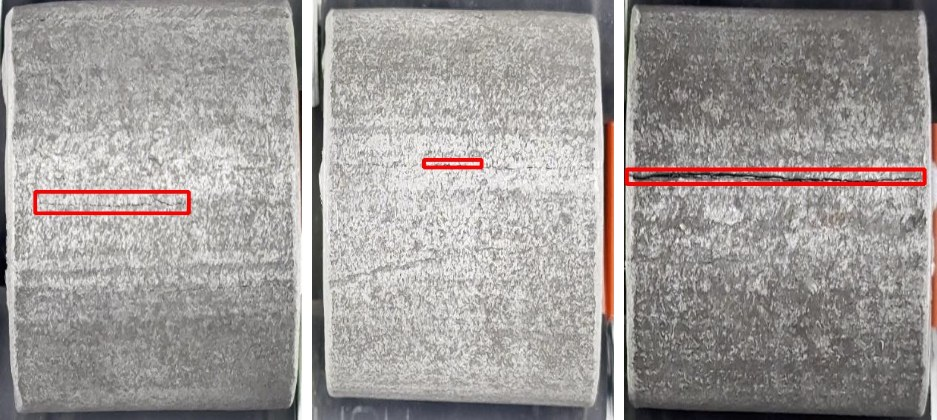
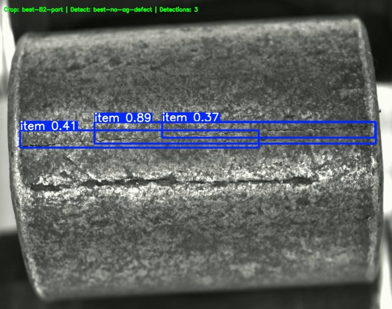

# Hackathon Experiments and Configurations

Working materials from the hackathons I took part in: early experiments, data-preparation scripts and intermediate snapshots that did not make it into the final project repositories. The finished projects live in their own repositories; this one keeps the process that led to them.

| Folder | Hackathon | Date | Final project |
|---|---|---|---|
| [hackathon-1-electrictraffic](hackathon-1-electrictraffic) | Electricity consumption and tariff analysis | April 2025 | [electrictraffic-api](https://github.com/MP4-Player/electrictraffic-api), [electrictraffic-web](https://github.com/MP4-Player/electrictraffic-web) |
| [hackathon-2-centrinvest](hackathon-2-centrinvest) | Centr-Invest Bank, meeting planner (1st place) | October 2025 | [centrinvest-meeting-planner](https://github.com/MP4-Player/centrinvest-meeting-planner) |
| [hackathon-3-defect-detection](hackathon-3-defect-detection) | Online hackathon mini-task: surface defect detection on metal parts | October–November 2025 | not presented (the team did not reach the final defence) |

## Hackathon 1: Electrictraffic (April 2025)

Preparation scripts written on the eve of the hackathon, before the API and the web app.

| File | What it does |
|---|---|
| [generate_synthetic_hourly_data.py](hackathon-1-electrictraffic/generate_synthetic_hourly_data.py) | Generates a synthetic hourly consumption report for one month in the format of a retail electricity bill: working days and weekends, actual volume, balancing-market price, retail mark-up, network services, total cost. Output: `generated_data.xlsx` |
| [demand_analysis.py](hackathon-1-electrictraffic/demand_analysis.py) | Loads monthly consumption CSV files of several enterprises (tries several encodings and column names), plots consumption with outliers highlighted, compares enterprises and analyses seasonality |
| [plot_monthly_demand.py](hackathon-1-electrictraffic/plot_monthly_demand.py) | Plots month-by-month values for each year from every CSV in `data/` and saves the charts next to the files |
| [data/demand_dataset_monthly.xlsx](hackathon-1-electrictraffic/data/demand_dataset_monthly.xlsx) | Monthly demand dataset: company, month, used and unused demand, energy consumption by tariff component (26 rows) |

```bash
pip install pandas numpy matplotlib seaborn openpyxl
python generate_synthetic_hourly_data.py
```

## Hackathon 2: Centr-Invest (October 2025)

[backend-integration-snapshot](hackathon-2-centrinvest/backend-integration-snapshot) is the state of the app on 25 October 2025, 21:24–21:43: between the "App v4" (mobile meetings interface) and "Final version" commits of [centrinvest-meeting-planner](https://github.com/MP4-Player/centrinvest-meeting-planner). It shows the moment the React frontend was switched from mock storage to the real FastAPI + PostgreSQL backend:

- `src/services/api.ts`: JWT auth headers and a common response handler instead of the mock storage service;
- `src/hooks/*`, `src/pages/dashboard/*`: pages reworked to call the API;
- `main.py`, `database_schema.sql`, `requirements.txt`, `start_backend.bat`: the first version of the backend;
- `test_api.py`, `TESTING_GUIDE.md`, `BACKEND_INTEGRATION.md`, `FIXES_SUMMARY.md`: API smoke test and integration notes.

Database credentials are read from environment variables (`DB_HOST`, `DB_NAME`, `DB_USER`, `DB_PASSWORD`, `DB_SSLMODE`); the host in the documentation is replaced with `<DB_HOST>`. `node_modules` and `.env` are not included.

```bash
npm install && npm run dev          # frontend
pip install -r requirements.txt
python main.py                      # backend
```

Team: [@meeporen](https://github.com/meeporen), [@vladuliksss](https://github.com/vladuliksss). My part: frontend, backend and help with the ML module.

## Hackathon 3: Surface defect detection (October–November 2025)

A mini-task of an online hackathon: find surface defects (cracks, scratches) on cylindrical metal parts in video. The work stopped before the defence, so this folder keeps what was left: a description of the annotated datasets and of the result videos, and two trained models. The pipeline code itself has not survived.

**Pipeline.** Two YOLO stages run on every video frame:

1. a *crop* model finds the part (class `part`) and the frame is cropped to it;
2. a *detect* model looks for defects on the cropped part (class `item`).

**Datasets** (frames extracted from videos, bounding boxes annotated in [LabelMe](https://github.com/wkentaro/labelme), one class `defect`):

| Dataset | Frames | Annotated frames | Boxes |
|---|---|---|---|
| 1dataset | 2,715 | 1,259 | 1,283 |
| 2dataset | 818 | 334 | 359 |
| 3dataset | 2,594 | 1,092 | 1,108 |
| 4dataset | 2,764 | 1,228 | 1,301 |
| **Total** | **8,891** | **3,913** | **4,051** |

The dataset itself is not published.



**Models** (Ultralytics 8.3.162, validation metrics stored in the checkpoints):

| File | Stage | Architecture | Class | Trained | Epochs | Precision | Recall | mAP50 | mAP50-95 |
|---|---|---|---|---|---|---|---|---|---|
| `best-1.pt` | crop | YOLOv8m | `part` | 16 Oct 2025 | 50 | 0.992 | 1.000 | 0.995 | 0.947 |
| `best_2.pt` | detect | YOLO11n | `item` | 12 Nov 2025 | 100 | 0.986 | 0.964 | 0.981 | 0.707 |

**Results.** The pipeline produced 80 result videos (22 Nov 2025, not published): every combination of 4 crop models (`best-1`, `best-2`, `best-3`, `best-82-part`) and 4 detect models (`best_1`, `best_2`, `best_3`, `best-no-ag-defect`) on 5 test videos. Each frame is annotated with the model pair and the number of detections. Only `best-1.pt` and `best_2.pt` of these models are available.



*Crop `best-82-part` + detect `best-no-ag-defect`: thin cracks are found (confidence 0.37–0.89), while the larger crack below is missed on this frame.*

**Download** (release [hackathon-3-defect-detection](https://github.com/MP4-Player/hackathon-experiments-and-configs/releases/tag/hackathon-3-defect-detection)):

| File | Size | Contents |
|---|---|---|
| `best-1.pt` | 52 MB | Crop model |
| `best_2.pt` | 5 MB | Defect detection model |

```python
from ultralytics import YOLO

part = YOLO("best-1.pt")(frame)[0]           # 1. find the part
x1, y1, x2, y2 = map(int, part.boxes.xyxy[0])
defects = YOLO("best_2.pt")(frame[y1:y2, x1:x2])  # 2. find defects on the crop
```
